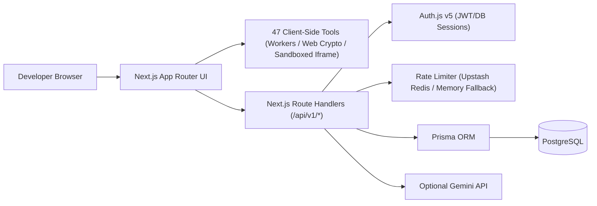
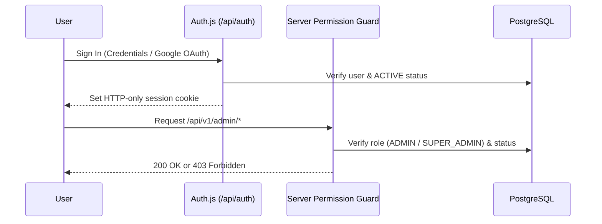

# Architecture — DevTools Hub

## System Architecture

```mermaid
flowchart LR
  User["Developer Browser"] --> NextUI["Next.js App Router UI"]
  NextUI --> ClientTools["47 Client-Side Tools (Workers / Web Crypto / Sandboxed Iframe)"]
  NextUI --> ApiV1["Next.js Route Handlers (/api/v1/*)"]
  ApiV1 --> Auth["Auth.js v5 (JWT/DB Sessions)"]
  ApiV1 --> RateLimit["Rate Limiter (Upstash Redis / Memory Fallback)"]
  ApiV1 --> Prisma["Prisma ORM"]
  Prisma --> Postgres[("PostgreSQL")]
  ApiV1 --> Gemini["Optional Gemini API"]
```

## Authentication & Authorization Flow

```mermaid
sequenceDiagram
  participant U as User
  participant A as Auth.js (/api/auth)
  participant P as Server Permission Guard
  participant D as PostgreSQL
  U->>A: Sign In (Credentials / Google OAuth)
  A->>D: Verify user & ACTIVE status
  A-->>U: Set HTTP-only session cookie
  U->>P: Request /api/v1/admin/*
  P->>D: Verify role (ADMIN / SUPER_ADMIN) & status
  P-->>U: 200 OK or 403 Forbidden
```
