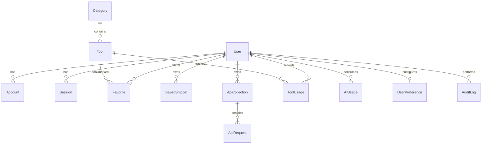

# Database Schema — DevTools Hub

```mermaid
erDiagram
  User ||--o{ Account : has
  User ||--o{ Session : has
  User ||--o{ Favorite : saves
  User ||--o{ SavedSnippet : owns
  User ||--o{ ApiCollection : owns
  User ||--o{ ToolUsage : records
  User ||--o{ AIUsage : consumes
  User ||--o| UserPreference : configures
  User ||--o{ AuditLog : performs
  Category ||--o{ Tool : contains
  Tool ||--o{ Favorite : bookmarked
  Tool ||--o{ ToolUsage : tracked
  ApiCollection ||--o{ ApiRequest : contains
```

See [prisma/schema.prisma](file:///e:/New%20folder/Private/DevTools%20Hub/prisma/schema.prisma) for the complete PostgreSQL schema, indexes, and foreign keys.
